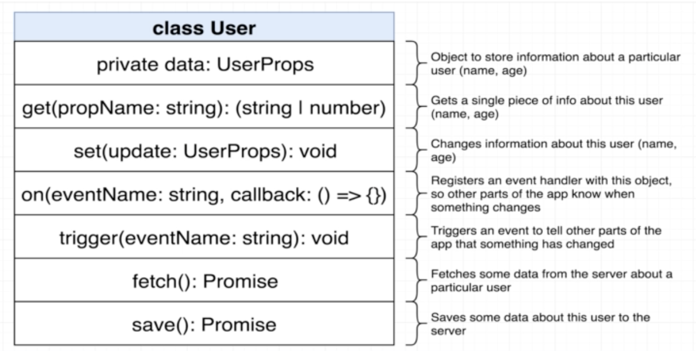

# microurb_web_framework

Inside of this framework I have two types of classes:

1. Model Classes

The Model classes are those inside the framework that are meant to handle some data. Model classes represent resources or things inside of the application such as blog posts, users, images, comments, etcetera.

2. View Classes

The View classes are responsible for producing HTML and displaying it to the user. It is also responsible for handling events caused by the user like clicks, typing, pressing the enter key and so on.

This web framework was meant to start you off with something simplistic at the beginning, but this framework is also capable of being used to build very complex applications.

You can start off with an application that tells you something about a user such as a `name` property and an `age` property similar to what you see in the mockup below:

**Requirements**

- To build the mockup as you see it above, you will probably need to create a class to represent a User and all of its data (i.e. name and age).

**3 Distinct Purposes**

- The User class also needs to have the ability to store some data, retrieve it and change it.

- The User class also needs to have the ability to notify the rest of the application when some data has changed.

- The User class also needs to be able to persist data to some outside server and then retrieve it at some future point.

**Note on Implementation Approach**

I built up the User class as a mega class, meaning it had a ton of methods and functionality inside of it.

I realized that I needed more than just User data, as a framework, I needed the ability to anticipate other develoers's needs for representing a blog post, an image or comment and not just users. So the general idea with the above diagram is reusability.

I built up the class of User and refactored it to use composition to handle three different areas of functionality and User was refactored to represent anything like blog post, image, comments and so on.

This is the Extraction Approach. I built up a specific application to represent a user and then extracted some reusable library out of it.

**How was the User built to implement the 3 Distinct Pieces of Functionality?**

This diagram below will assist you in understanding the distinct methods I created to implement each of the 3 distinct pieces of functionality.

All the above functionality was built directly into the User class and then I pulled out certain parts of it and used composition. Then I refactored it again and made a reusable class out of it used to represent any kind of data.

**class User**

- A user will have one distinct piece of data called `data`. It will be an object that stores all the different properties that deescribe a very particular user such as their name, age and so on. I marked the property as being `private`. This modifier means we cannot access this data property from outside this class. The whole idea here is not to allow other developers to reach into a user and mess with its data manually.

Instead, developers will have to use other methods to manipulate the data, specifically `get` and `set` methods. The purpose of `get` is to pass in the name of some property we want to retrieve. If a user has some data tied to it, we can retrieve it by calling `get` and passing in a string of `name` like so: `get('name')` or with age: `get('age')`. Get can return any type of data and thats why I annotated the return type in the diagram as either a string or a number. Eventually, this return type will be improved.

`set()` method will be used to change any data related to a user. It will take in some object that describes how to update information on a user like so: `set(age: 39)`.
